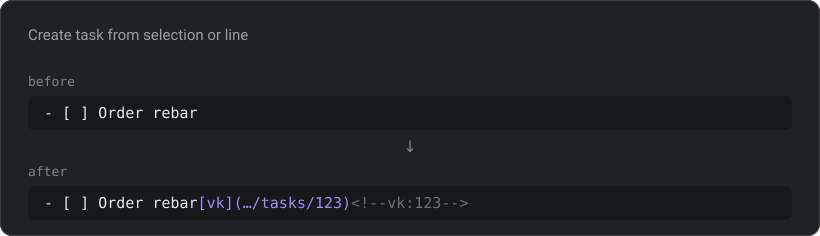
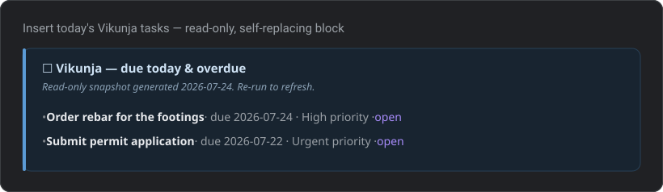

# Vikunja Note Tasks

> **Unofficial** Obsidian plugin for turning note lines into tasks on your own
> self-hosted [Vikunja](https://vikunja.io) server — explicitly, one command at a
> time. No background sync, no reconciliation, no telemetry.

Vikunja Note Tasks keeps your notes as the place you *think* and Vikunja as the
place you *track*. A task starts life as an ordinary Markdown line. When you run a
command, the plugin creates it in Vikunja and rewrites the line in place with a
link and a small marker — so the line stays readable and the two never drift into
a silent, magical sync you can't reason about.

> This project is **not affiliated with or endorsed by Vikunja.** "Vikunja" is
> used only to describe compatibility.

## How it looks

Capturing a line keeps your text verbatim and appends a link plus a hidden marker:



The read-only, self-replacing callout written by "Insert today's Vikunja tasks":



> These are illustrations of the Markdown the plugin produces. Annotated in-app
> screenshots are welcome — drop them into `docs/media/` and update the links.

## Quick start

1. In Vikunja, create an **API token** (Settings → API Tokens) with the least
   privilege you need (read/write on tasks, projects, and labels). See
   [USER_GUIDE.md](USER_GUIDE.md) for the exact steps.
2. Install the plugin (see [Installing](#installing)).
3. Open **Settings → Vikunja Note Tasks**, enter your **Base URL** and **API
   token**, and click **Test connection**. Pick a **default project**.
4. In any note, put your cursor on a line like `- [ ] Order rebar` and run the
   command **"Vikunja Note Tasks: Create task from selection or line"** from the
   command palette.

The line becomes:

```md
- [ ] Order rebar [vk](https://vikunja.example.com/tasks/123) <!--vk:123-->
```

## Commands

All commands are in the command palette. None have a default hotkey (per Obsidian
guidelines) — assign your own if you like.

| Command | What it does |
| --- | --- |
| Create task from selection or line | Creates a Vikunja task from the selection or current line and rewrites the line with a link + marker. |
| Create task in project… | Same, but a fuzzy picker chooses the project for this one task, overriding frontmatter and folder rules. |
| Push all open tasks in note to Vikunja | Creates a task for every unmarked `- [ ]` line, rewrites each, and shows a summary. |
| Mark Vikunja task done | Sets the current line's task done in Vikunja and flips the checkbox to `- [x]`. |
| Toggle Vikunja task done/undone | Same, in either direction. |
| Refresh Vikunja task statuses in note | Fetches the current done-state for every marker and updates local checkboxes to match. |
| Insert today's Vikunja tasks | Inserts a read-only callout of tasks due today or overdue. Re-running replaces the block. |
| Open Vikunja task in browser | Opens the current line's task in your browser. |

The two creating commands pick their destination project from the note's
`vikunja-project` frontmatter, then your folder rules, then the default project —
see [capture routing](USER_GUIDE.md#capture-routing). Each success Notice names
the project it used and why. Labels come from your default labels, the note's
`vikunja-labels`, and any `#tags` on the captured line — see
[labels](USER_GUIDE.md#labels).

## Settings

| Setting | Purpose |
| --- | --- |
| Base URL | Your Vikunja instance, e.g. `https://vikunja.example.com`. |
| API token | A Vikunja API token. **Stored unencrypted** in the vault's plugin data — use a least-privilege token. |
| Default project | Where new tasks are created when nothing more specific applies (fill the dropdown with **Test connection**). |
| Folder rules | `pattern = project ID` per line, routing captures by the note's folder. See [capture routing](USER_GUIDE.md#capture-routing). |
| Default labels | Comma-separated labels applied to every created task, on top of note and line labels. |
| Parse Tasks-plugin emoji dates | Read a `📅 YYYY-MM-DD` due date off the captured line and keep emoji date fields out of the title. On by default. |
| Include undated tasks | Whether "Insert today's tasks" also lists tasks with no due date. |
| Open in browser after create | Open each newly created task in the browser. |

## Design principle: explicit actions only

Every remote action is something **you** trigger. The plugin has:

- **no** background polling or scheduled sync,
- **no** reconciliation engine trying to merge two sources of truth,
- **no** watching of Vikunja for remote changes.

These are permanent non-goals (see [ROADMAP.md](ROADMAP.md)), not missing
features. The marker on each line is the source of truth for *"has this line been
captured?"* — nothing happens to it unless you run a command. The one command
that treats Vikunja as authoritative, **Refresh**, only ever updates local
checkboxes and never edits or deletes your text.

## Network-use disclosure

- The plugin connects **only** to the Base URL you configure — your own Vikunja
  server — and to nothing else.
- No telemetry, analytics, ads, or third-party endpoints. No data leaves your
  vault except the task content you explicitly send to your Vikunja server.
- All requests use Obsidian's `requestUrl`, so the plugin works on mobile without
  CORS issues.

## Installing

### Now: via BRAT (beta)

1. Install the **BRAT** community plugin.
2. In BRAT, "Add Beta Plugin" and enter this repository:
   `mds08011/vikunja-note-tasks`.
3. Enable **Vikunja Note Tasks** in Settings → Community plugins.

### Later: community directory

Once accepted into the Obsidian community plugin directory, you'll be able to
install it from **Settings → Community plugins → Browse**.

## Documentation

- [USER_GUIDE.md](USER_GUIDE.md) — non-developer walkthroughs, the frontmatter
  contract, mobile toolbar setup, and troubleshooting.
- [ROADMAP.md](ROADMAP.md) — the plan and the permanent non-goals.
- [docs/DEVELOPER_GUIDE.md](docs/DEVELOPER_GUIDE.md) — architecture, the marker
  spec, and how to add a command.
- [docs/api-notes.md](docs/api-notes.md) — every Vikunja endpoint used.
- [docs/adr/](docs/adr/) — architecture decision records (why explicit-only, the
  marker format, v1/v2 strategy, `requestUrl`, licensing).
- [docs/templates/](docs/templates/) — example notes demonstrating the contract.
- [CONTRIBUTING.md](CONTRIBUTING.md) — contribution and DCO policy.
- [RELEASING.md](RELEASING.md) — release procedure and the tag rule.

## License

[GPL-3.0-or-later](LICENSE). This plugin consulted the GPL-licensed
[Heiss/obsidian-vikunja-plugin](https://github.com/Heiss/obsidian-vikunja-plugin)
for reference; it deliberately does **not** implement bidirectional sync.
